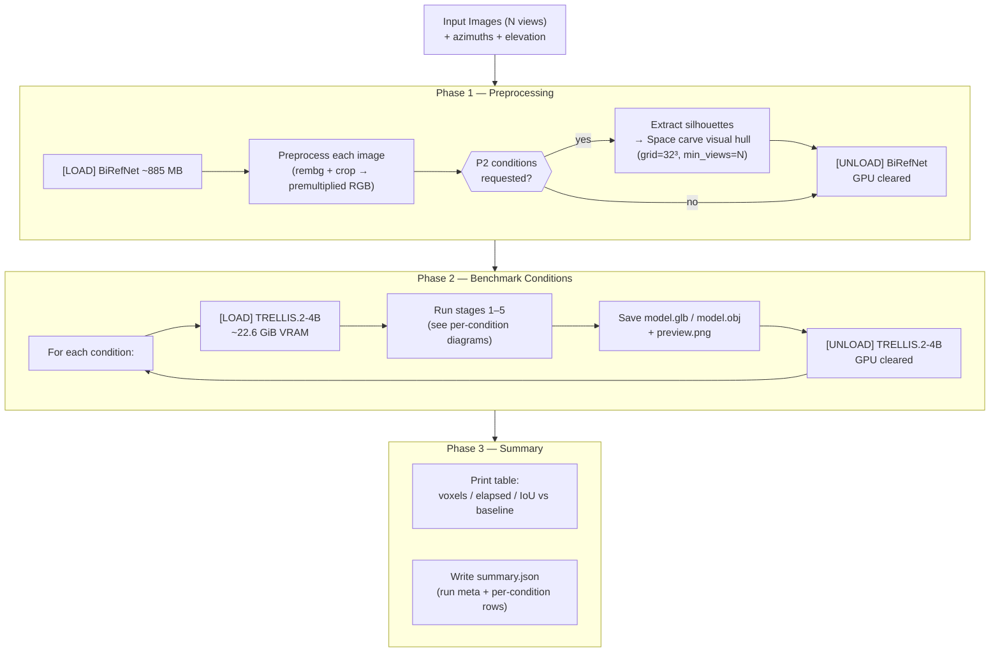
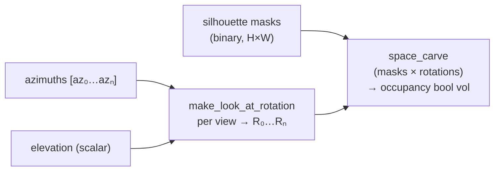
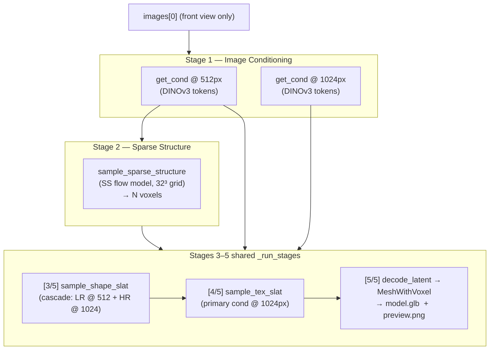
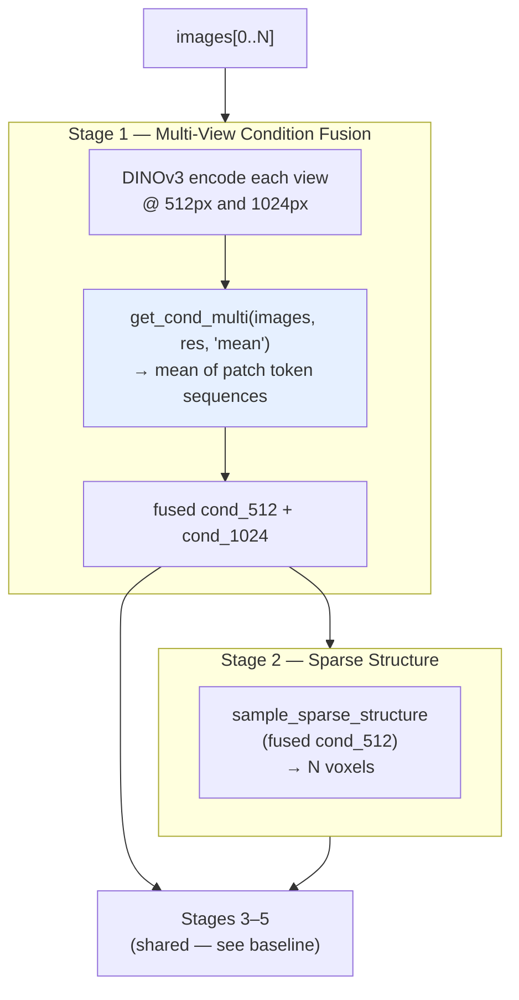
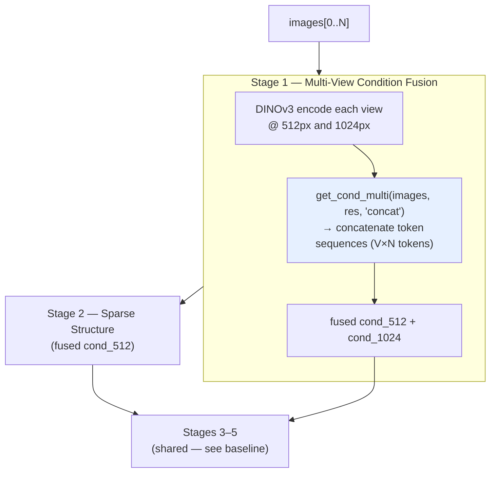
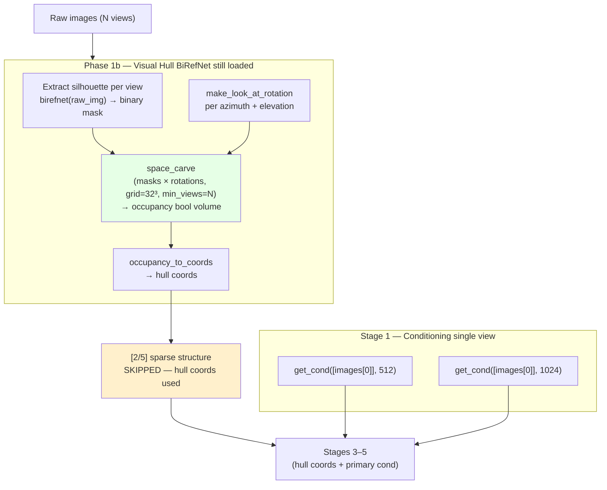
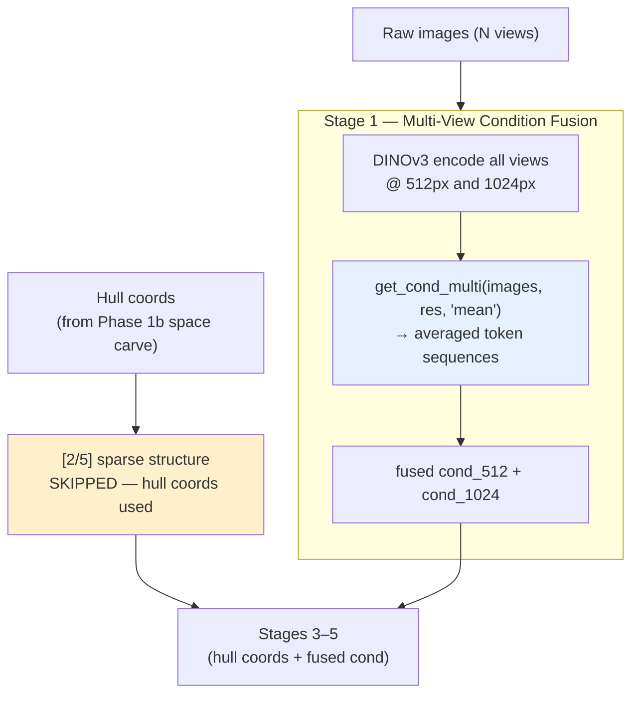
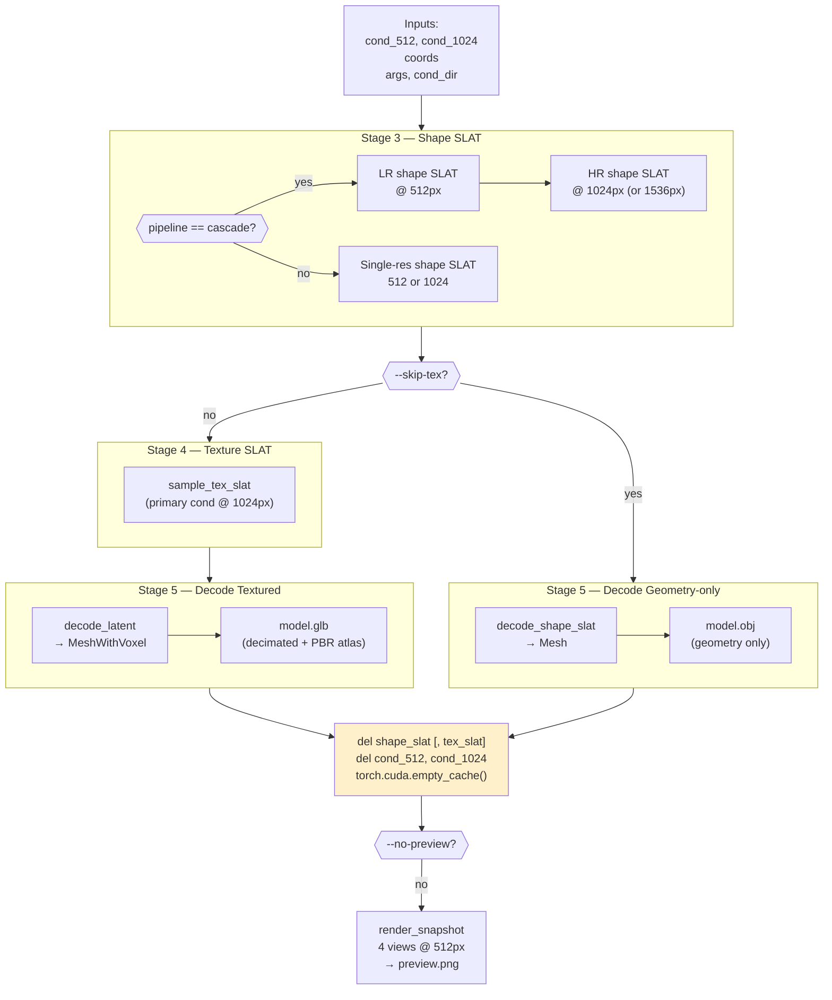
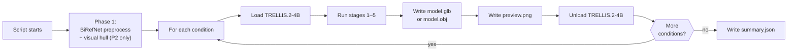

# Multi-View Benchmark Script — `benchmark_multiview.py`

Runs a fixed test matrix of five research conditions against the same set of
input images and saves one model + preview per condition for direct visual
comparison. Designed for systematic multi-view research evaluation, not
one-off generation.

---

## Overview



---

## Memory Model

The full 4B pipeline is never resident at the same time as BiRefNet. The GPU timeline looks like:

```mermaid
gantt
    title GPU Memory Timeline
    dateFormat  X
    axisFormat  %s

    section BiRefNet (885 MB)
    Load + preprocess + hull  :active, 0, 30

    section VRAM clear
    Empty                     :milestone, 30, 30

    section TRELLIS baseline
    Load + run + unload       :35, 65

    section TRELLIS P1-mean
    Load + run + unload       :66, 96

    section TRELLIS P1-concat
    Load + run + unload       :97, 127

    section TRELLIS P2-scaffold
    Load + run + unload       :128, 158

    section TRELLIS P2-scaffold+P1
    Load + run + unload       :159, 189
```



---

## Azimuth & Elevation — Camera Geometry

Azimuth and elevation define the **camera orbit positions** used by the visual-hull computation in Phase 1b. They have no effect on the baseline, P1-mean, or P1-concat conditions — those conditions operate purely in DINOv3 feature space and carry no notion of geometric camera pose.

### Where they enter the computation

The only code path that consumes azimuth/elevation is the scaffold pipeline:

```python
# main() — Phase 1b
scaffold_rotations = [
    make_look_at_rotation(az, args.elevation) for az in azimuths
]
occupancy = space_carve(
    scaffold_masks, scaffold_rotations,
    grid_size=ss_res, min_views=min_views,
)
```

`make_look_at_rotation(azimuth, elevation)` returns a **look-at rotation matrix** for a camera placed at:
- `azimuth` degrees around the vertical (Y) axis — 0° = front, 90° = right, 180° = rear, 270° = left
- `elevation` degrees above the horizontal plane — positive values point the camera down toward the object

These rotation matrices are forwarded to `space_carve`, which projects each binary silhouette mask into the 3D voxel grid and marks a voxel as occupied only if it falls inside the foreground silhouette in at least `min_views` projections.



The resulting `occupancy` volume replaces Stage 2 (sparse-structure diffusion) entirely for P2 conditions by providing voxel coordinates that bypass the diffusion model.

### Auto-azimuth default

When `--azimuths` is omitted the script distributes views evenly around the full circle:

```python
azimuths = [360.0 * i / n for i in range(n)]
```

| N views | Auto azimuths |
|---------|---------------|
| 2 | 0°, 180° |
| 3 | 0°, 120°, 240° |
| 4 | 0°, 90°, 180°, 270° |
| 6 | 0°, 60°, 120°, 180°, 240°, 300° |

This is appropriate for images captured at regular intervals around an object. For photos taken at irregular angles, always supply explicit `--azimuths` — one value per input image in the same order as the image list.

### Impact on visual-hull quality

The rotation matrices must reflect the **actual camera positions** used when photographing the object. Mismatches distort or inflate the hull:

| Mismatch | Effect on hull |
|----------|----------------|
| Wrong azimuth order | Silhouettes projected from wrong directions → noisy, asymmetric volume |
| All azimuths identical | All views project from the same direction → hull becomes a tube/slab instead of a closed volume |
| Elevation too high | Camera looks steeply down → hull collapses vertically into a flat disc |
| Elevation at 0° | Camera at the horizon → tall objects may lose top coverage |
| Elevation negative | Camera below the object → only valid for explicit underside captures |

The script prints a density warning whenever more than 80% of the grid is occupied:

```
[WARN] density >80% — hull may be nearly full.
       Check azimuths or try --min-views-scaffold with a lower value.
```

This almost always indicates that the azimuths don't match the actual capture positions, or that `--elevation` is far from the real camera height.

### Elevation is shared across all views

Unlike `--azimuths` (one value per image), `--elevation` is a **single scalar** applied to every view. All cameras are assumed to orbit at the same elevation angle. This is a sound approximation for turntable-style captures; for mixed-elevation rigs (e.g. one overhead shot and several side shots) the space carve will be an approximation.

### No effect on P1 / baseline conditions

Azimuth and elevation values are parsed, logged in `summary.json` under `azimuths_deg` and `elevation_deg`, and printed at startup — but they are **not consumed** by any code path in `run_baseline`, `run_p1`, or `_run_stages`. Running with `--skip-scaffold` therefore makes these flags completely inert with respect to output geometry.

---

## Condition 1 — `baseline` (Default Single-Image Pipeline)

The reference point. Only the first image is used throughout all five stages.



---

## Condition 2 — `P1-mean` (Condition Fusion, Mean)

DINOv3 patch tokens from **all views** are extracted and averaged into a single
fused conditioning vector **before** Stage 2. The rest of the pipeline is
identical to baseline.



**What changes vs baseline:** stage 1 replaces `get_cond([images[0]])` with
`get_cond_multi(images, res, 'mean')`. Stages 2–5 are unchanged.

---

## Condition 3 — `P1-concat` (Condition Fusion, Concat)

Same as P1-mean but the patch tokens from all views are **concatenated** rather
than averaged, producing a V×N token sequence. This gives the model access to
the full per-view detail at the cost of a longer context.



---

## Condition 4 — `P2-scaffold` (External Visual-Hull Bypass)

Stage 2 (sparse structure diffusion) is **skipped entirely**. The voxel
scaffold is replaced by a deterministic visual hull computed from silhouettes
using space carving in Phase 1. The hull coords are fed directly into Stage 3.
Conditioning at Stages 3–5 uses only the primary image.



---

## Condition 5 — `P2-scaffold+P1` (Hull + Mean Conditioning)

Combines the external visual hull from P2 with the multi-view mean conditioning
from P1. Stage 2 is still skipped; the fused conditioning drives Stages 3–5.



---

## Shared Stage Runner — `_run_stages` (Stages 3–5)

All five conditions delegate to the same stage runner once their coords and
conditioning are ready.



The `del + empty_cache()` step reclaims ~300–600 MiB of SLAT and conditioning
tensors so nvdiffrast can allocate its renderer buffers without OOM, while the
22.6 GiB pipeline weights remain resident.

---

## Output Files

### Directory Layout

Each script invocation creates one timestamped run folder. Condition
sub-folders use the condition name (`+` replaced with `_plus_`):

```
{output_dir}/
└── run_YYYYMMDD_HHMMSS/
    ├── baseline/
    │   ├── model.glb          ← textured mesh (or model.obj with --skip-tex)
    │   └── preview.png        ← 4-view horizontal strip, 512px per view
    ├── P1-mean/
    │   ├── model.glb
    │   └── preview.png
    ├── P1-concat/
    │   ├── model.glb
    │   └── preview.png
    ├── P2-scaffold/
    │   ├── model.glb
    │   └── preview.png
    ├── P2-scaffold_plus_P1/   ← "+" → "_plus_"
    │   ├── model.glb
    │   └── preview.png
    └── summary.json
```

### `model.glb` (default)

Produced by `decode_latent` + `o_voxel.postprocess.to_glb`:
- Decimated mesh (`--decimation-target` faces, default 500 000)
- Baked PBR texture atlas (`--texture-size` px, default 1024)
- Base colour, metallic, roughness, normal — WebP-compressed

### `model.obj` (with `--skip-tex`)

Produced by `decode_shape_slat` + trimesh export:
- Geometry-only, no textures
- Faster and ~half the VRAM — useful for voxel/shape analysis

### `preview.png`

4-view horizontal strip rendered by `render_snapshot` at 512 px per frame
(total: 2048×512 px):
- Textured mesh → `PbrMeshRenderer` (shaded output, synthetic grey envmap)
- Geometry-only → `MeshRenderer` (normal map output)
- Skipped with `--no-preview`
- Skipped automatically with `--sparse-only`

### `summary.json`

Written once after all conditions complete. Schema:

```json
{
  "run": {
    "run_id": "20260511_110000",
    "run_dir": "/abs/path/to/run_20260511_110000",
    "started_at": "2026-05-11T11:00:00",
    "total_elapsed_s": 874.2,
    "preprocess_elapsed_s": 4.1,
    "images": ["/abs/path/front.png", "..."],
    "azimuths_deg": [345, 310, 205, 325],
    "elevation_deg": 10,
    "model": "microsoft/TRELLIS.2-4B",
    "rembg_model": "briaai/RMBG-2.0",
    "pipeline_type": "1024_cascade",
    "seed": 42,
    "skip_tex": false,
    "skip_scaffold": false,
    "sparse_only": false,
    "no_preview": false,
    "texture_size": 1024,
    "decimation_target": 500000,
    "conditions_run": ["baseline", "P1-mean", "P1-concat", "P2-scaffold", "P2-scaffold+P1"],
    "scaffold": {
      "grid_size": 32,
      "min_views": 4,
      "occupied_voxels": 1820,
      "total_voxels": 32768,
      "density_pct": 5.56
    }
  },
  "conditions": [
    {
      "name": "baseline",
      "status": "ok",
      "voxels": 2485,
      "iou_vs_baseline": null,
      "elapsed_s": 174.1,
      "stage_times": {
        "load_s": 18.2,
        "conditioning_s": 2.3,
        "sparse_structure_s": 7.0,
        "shape_slat_s": 26.2,
        "tex_slat_s": 88.4,
        "decode_s": 12.1,
        "preview_s": 4.3,
        "unload_s": 1.1
      },
      "model_path": "/abs/path/baseline/model.glb",
      "preview_path": "/abs/path/baseline/preview.png",
      "error": null
    }
  ]
}
```

`iou_vs_baseline` is the 3-D voxel IoU between each condition's sparse coords
and the baseline coords, computed over a 64³ dense grid. `null` for the
baseline itself and for any `--sparse-only` run that produced no model.

### When are files written?



All model and preview files are written **inside the condition loop**, one
condition at a time. `summary.json` is written **once** after the loop
completes. If the script is killed mid-run, already-completed condition folders
are intact and `summary.json` is simply absent.

---

## Stdout Log Format

Each stage prints a structured line:

```
  [N/5] stage name ...
       └─ done in 26.2s

  [LOAD] microsoft/TRELLIS.2-4B ...
       └─ done in 18.2s
       22.6 GiB allocated, 22.8 GiB reserved
```

The final summary table printed to stdout:

```
================================================================
  Benchmark Summary
================================================================
Condition              Voxels   Elapsed   IoU vs base  Status
--------------------------------------------------------------------
baseline                 2485    174.1s             —  model
  load=18.2s  cond=2.3s  sparse=7.0s  shape=26.2s  tex=88.4s  decode=12.1s  preview=4.3s
  model   → ./out/run_20260511_110000/baseline/model.glb
  preview → ./out/run_20260511_110000/baseline/preview.png
P1-mean                  2611    173.8s         0.812  model
  ...
```

---

## CLI Quick Reference

```bash
# All 5 conditions, 4 views with explicit azimuths
python scripts/benchmark_multiview.py \
    front.png right.png rear.png left.png \
    --azimuths 345 310 205 325 --elevation 10 \
    --output-dir ./out --pipeline 1024_cascade --seed 42

# Skip P2 conditions (no visual hull needed, faster)
python scripts/benchmark_multiview.py \
    front.png side.png \
    --skip-scaffold --output-dir ./out

# Geometry-only (no texture SLAT, ~half VRAM, faster)
python scripts/benchmark_multiview.py \
    front.png right.png rear.png left.png \
    --skip-tex --output-dir ./out

# Sparse-only — count voxels, write nothing, very fast
python scripts/benchmark_multiview.py \
    front.png right.png rear.png left.png \
    --sparse-only --output-dir ./out

# Run specific conditions only
python scripts/benchmark_multiview.py \
    front.png right.png rear.png left.png \
    --conditions baseline P1-mean --output-dir ./out

# Relax visual hull when using >4 views
python scripts/benchmark_multiview.py \
    v1.png v2.png v3.png v4.png v5.png v6.png \
    --min-views-scaffold 3 --output-dir ./out
```

---

## Flag Reference

| Flag | Default | Effect |
|---|---|---|
| `--output-dir` | `./out` | Root directory for all run folders |
| `--azimuths` | evenly spaced 360° | Camera azimuth per image (degrees) |
| `--elevation` | `15.0` | Camera elevation for all views (degrees) |
| `--pipeline` | `1024_cascade` | `512`, `1024`, `1024_cascade`, `1536_cascade` |
| `--seed` | `42` | Random seed applied to every condition |
| `--model` | `microsoft/TRELLIS.2-4B` | HuggingFace model ID or local path |
| `--rembg-model` | `briaai/RMBG-2.0` | BiRefNet variant for background removal |
| `--skip-scaffold` | off | Omit P2-scaffold and P2-scaffold+P1 |
| `--skip-tex` | off | Skip texture SLAT; export `.obj` instead of `.glb` |
| `--sparse-only` | off | Stop after Stage 2; no model exported |
| `--no-preview` | off | Skip `preview.png` rendering |
| `--texture-size` | `1024` | PBR atlas resolution in pixels |
| `--decimation-target` | `500000` | Target face count for mesh decimation |
| `--min-views-scaffold` | all views | Min views a voxel must survive space carving |
| `--conditions` | all 5 | Run only the specified subset of conditions |

---

## Run topology (split scripts + UI)

[`scripts/benchmark_multiview.py`](../scripts/benchmark_multiview.py) is a **dispatcher**: it runs one subprocess per condition so the 4B pipeline is fully unloaded between conditions. Each subprocess targets [`scripts/runs/`](../scripts/runs/) (`baseline.py`, `p1_condition_fusion.py`, `p2_scaffold.py`, etc.) with `--dest-dir run_…/<condition_folder>/`.

Per-condition outputs still match this guide (`model.glb` / `preview.png` / `summary.json` per folder). **Note:** BiRefNet preprocessing now runs inside each subprocess (slightly more wall time than the old shared preprocess, but the same VRAM safety).

| Condition | Underlying script |
|-----------|-------------------|
| baseline | `runs/baseline.py` |
| P1-mean | `runs/p1_condition_fusion.py --mode mean` |
| P1-concat | `runs/p1_condition_fusion.py --mode concat` |
| P2-scaffold | `runs/p2_scaffold.py --cond-fusion primary` |
| P2-scaffold+P1 | `runs/p2_scaffold.py --cond-fusion mean` |

**Gradio visualizer:** [`app_multiview.py`](../app_multiview.py) — pick images under `./input`, choose a strategy, stream logs, inspect GLB + previews (does not import `trellis2` in the UI process).
