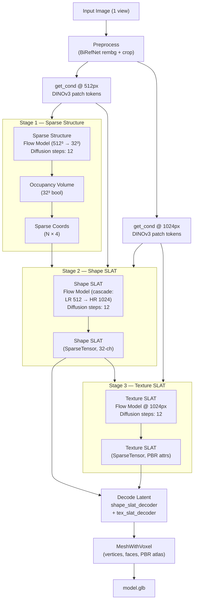
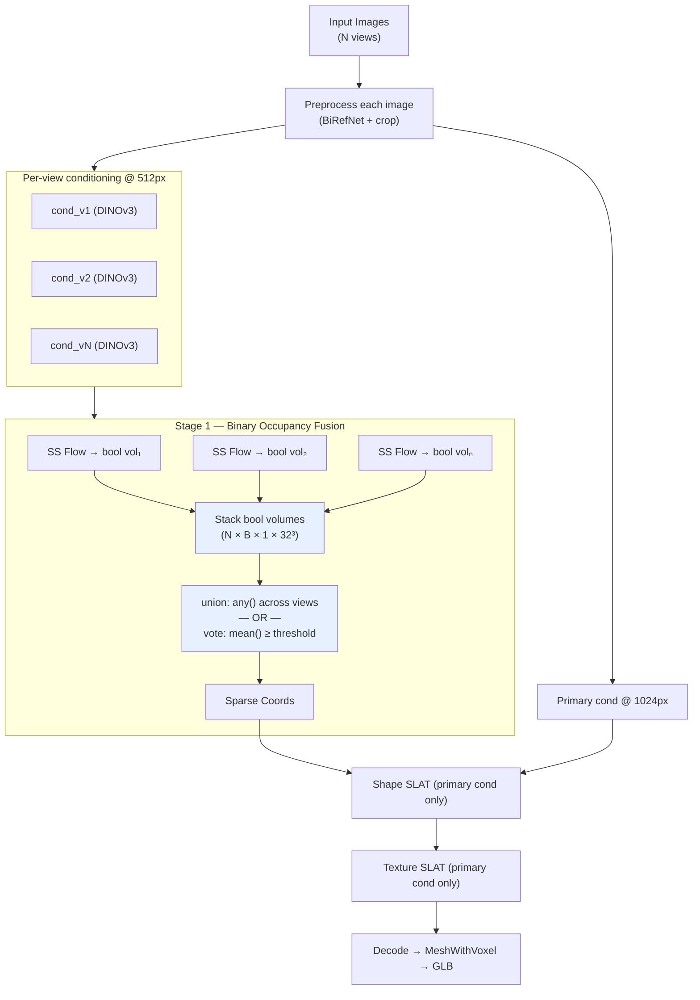
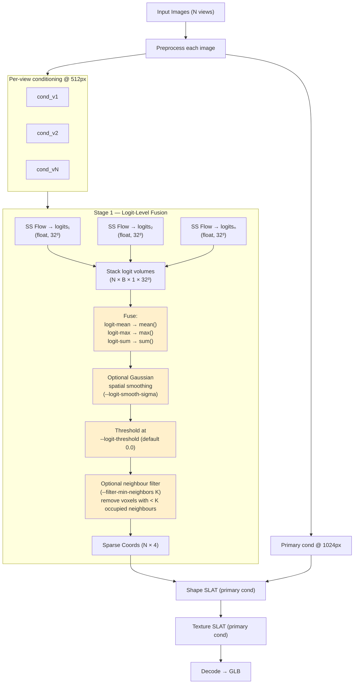
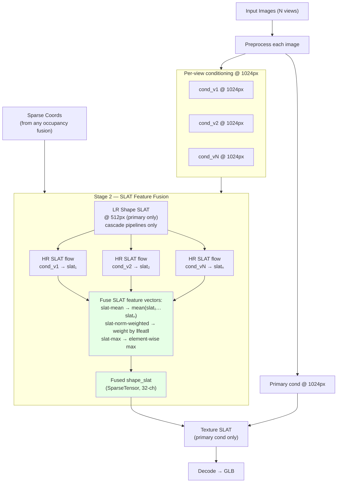
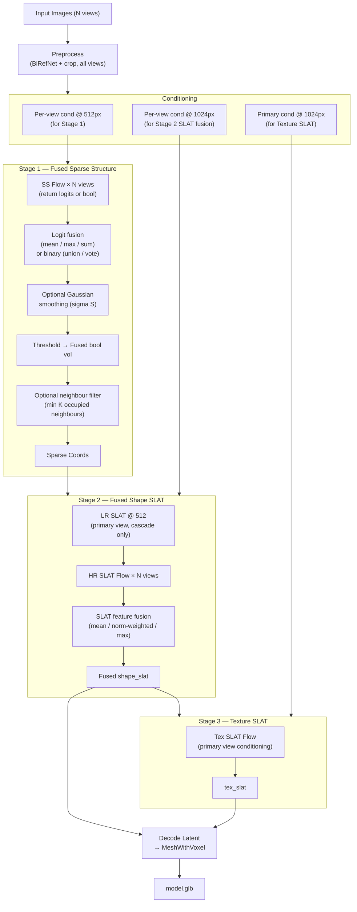
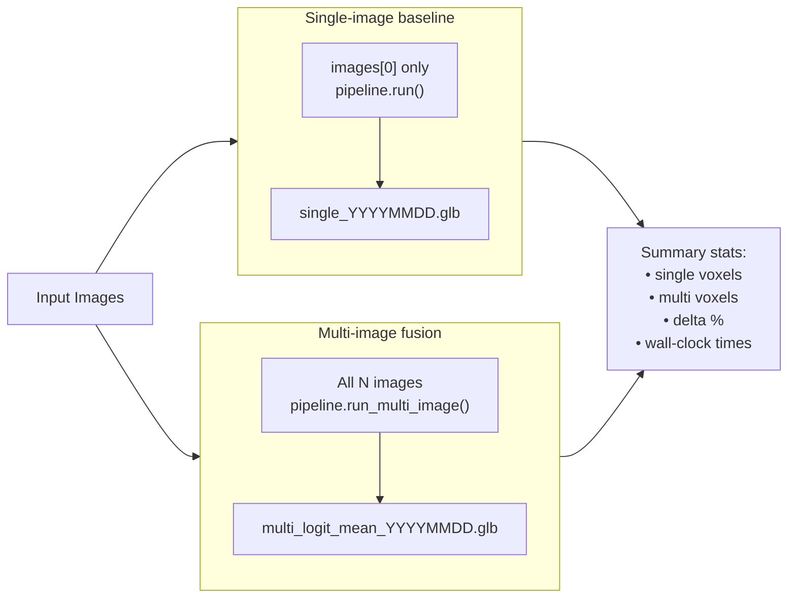
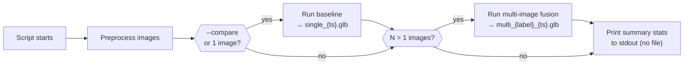

# Multi-Image Fusion Script — `test_multi_image_fusion.py`

This document describes the pipeline paths implemented in the multi-image fusion test script. The first diagram shows the **unmodified single-image (baseline) pipeline**. Each subsequent diagram shows what changes for each fusion strategy we added.

---

## 1. Default Single-Image Pipeline (Baseline)

The standard TRELLIS.2 flow. One image enters, DINOv3 extracts patch tokens, a sparse structure diffusion model samples a voxel scaffold, two SLAT flow models fill in shape and texture, and a decoder produces the final mesh.



---

## 2. Change A — Binary Occupancy Fusion (`union` / `vote`)

The same flow model runs **once per view**. Each view independently thresholds its occupancy volume to a binary mask, then the masks are merged. Shape and texture SLAT stages still use only the **primary (first) view** for conditioning.

**What changed:** Stage 1 — the sparse structure flow model is run `N` times (once per image), each producing its own bool volume. Those are stacked and merged before coords are extracted.



**Flags:**
| Flag | Default | Effect |
|---|---|---|
| `--fusion union` | — | Voxel is kept if **any** view fired |
| `--fusion vote` | — | Voxel is kept if ≥ `--vote-threshold` fraction of views fired |
| `--vote-threshold` | 0.5 | Majority threshold for `vote` mode |

**Known limitation:** binary thresholding per view discards weak-evidence voxels that might be corroborated across views. This was the primary motivation for logit-level fusion below.

---

## 3. Change B — Logit-Level Occupancy Fusion (`logit-mean` / `logit-max` / `logit-sum`)

Instead of binarising each view's output, the **raw decoder logits** (float scores before the threshold step) are preserved and merged across views. A **single threshold** is applied to the fused volume. Weak-evidence voxels that each view scores just below threshold can collectively cross it.



**Flags:**
| Flag | Default | Effect |
|---|---|---|
| `--fusion logit-mean` | — | Mean logit across views → threshold |
| `--fusion logit-max` | — | Max logit across views → threshold |
| `--fusion logit-sum` | — | Sum of logits → threshold |
| `--logit-threshold` | `0.0` | Decision boundary after fusion; lower = more voxels |
| `--logit-smooth-sigma` | `0.0` | 3-D Gaussian blur sigma (voxels) before threshold |
| `--filter-min-neighbors` | `0` | Remove isolated voxels with < K occupied neighbours |
| `--samples-per-view` | `1` | Run diffusion N times per view and average logits (ensemble) |

---

## 4. Change C — Shape SLAT Feature Fusion (`slat-mean` / `slat-norm-weighted` / `slat-max`)

This operates **deeper in the pipeline** — at the geometry representation level rather than the occupancy scaffold level. Instead of conditioning shape SLAT generation on only the first image, the flow model runs **once per view** at 1024 px, producing a full 32-channel SLAT tensor. Those tensors are fused before decoding.

For cascade pipelines (`1024_cascade`, `1536_cascade`), the **low-resolution LR stage** still uses only the primary view (fast, cheap); only the **high-resolution HR stage** is run per-view.



**Flags:**
| Flag | Default | Effect |
|---|---|---|
| `--slat-fusion primary` | default | First-image-only conditioning (no change vs baseline) |
| `--slat-fusion slat-mean` | — | Average 32-ch SLAT features across all views |
| `--slat-fusion slat-norm-weighted` | — | Weight each view's features by their L2 norm per token |
| `--slat-fusion slat-max` | — | Element-wise maximum across views |

---

## 5. Full Multi-Stage Pipeline (All Changes Combined)

Any combination of the above can be composed. This shows the complete flow when both logit-level occupancy fusion **and** SLAT feature fusion are active.



---

## 6. Compare Mode (`--compare`)

When `--compare` is passed, the script runs **both** the single-image baseline and the selected multi-image fusion path and saves both GLB files side-by-side for visual inspection.



---

## 7. Output Files

### Layout

All files are written flat into `--output-dir` (default `./out`). There are no sub-folders — each run appends timestamped GLB files to the same directory.

```
{output_dir}/
├── single_2026-05-11T113045.123.glb          # baseline (only with --compare or single-image input)
├── multi_logit_mean_2026-05-11T113412.456.glb
├── multi_logit_mean_sm0.8_2026-05-11T113700.789.glb
└── multi_logit_mean_sm0.8_slat_mean_2026-05-11T114002.111.glb
```

The directory is created automatically if it does not exist.

### File Naming Rules

Every output file is named `{label}_{YYYY-MM-DDTHHMMSS}.{ms}.glb`.

**Baseline file (`--compare` or single image):**

```
single_{timestamp}.glb
```

**Multi-image fusion file:**

The label is assembled from the active flags in order:

| Part | Condition | Example |
|---|---|---|
| `multi_{fusion}` | always | `multi_logit_mean` |
| `thr{value}` | `--logit-threshold` ≠ 0.0 | `thr-0.5` |
| `sm{value}` | `--logit-smooth-sigma` > 0.0 | `sm0.8` |
| `spv{N}` | `--samples-per-view` > 1 | `spv3` |
| `fn{K}` | `--filter-min-neighbors` > 0 | `fn2` |
| `{slat_fusion}` | `--slat-fusion` ≠ `primary` | `slat_mean` |

Parts are joined with `_`. Examples:

```
multi_union_2026-05-11T110000.000.glb
multi_logit_mean_2026-05-11T110000.000.glb
multi_logit_mean_sm0.8_fn2_2026-05-11T110000.000.glb
multi_logit_mean_sm0.8_spv3_fn2_slat_norm_weighted_2026-05-11T110000.000.glb
```

### GLB Contents

Each `.glb` file contains:
- A single decimated mesh (target: `--decimation` faces, default 200 000)
- A baked PBR texture atlas (`--texture-size` px, default 1024)
- Base colour, metallic, roughness, and normal maps packed into WebP-compressed textures

### When files are written



No timestamped flat GLBs are written by the dispatcher; instead each underlying run creates a folder `out/<strategy>_YYYYMMDD_HHMMSS/` with `model.glb`, `preview.png`, and `summary.json`. The summary (voxel counts, timing) is in `summary.json`; logs still go to stdout.

---

## Run topology (split scripts + UI)

The implementation is split so **each strategy runs in its own process** (full RAM/VRAM release between runs):

| Strategy | Script |
|----------|--------|
| Baseline (single image) | [`scripts/runs/baseline.py`](../scripts/runs/baseline.py) |
| P1 (`mean` / `concat` conditioning) | [`scripts/runs/p1_condition_fusion.py`](../scripts/runs/p1_condition_fusion.py) |
| P2 visual hull + SLAT | [`scripts/runs/p2_scaffold.py`](../scripts/runs/p2_scaffold.py) |
| Sparse fusion only (`primary` SLAT) | [`scripts/runs/sparse_fusion.py`](../scripts/runs/sparse_fusion.py) |
| Sparse + SLAT feature fusion | [`scripts/runs/slat_fusion.py`](../scripts/runs/slat_fusion.py) |

Shared helpers: [`scripts/runs/_common.py`](../scripts/runs/_common.py).

Legacy entrypoint [`scripts/test_multi_image_fusion.py`](../scripts/test_multi_image_fusion.py) shells out to the scripts above (CLI unchanged).

**Visualizer:** [`app_multiview.py`](../app_multiview.py) — Gradio UI that scans `./input`, runs a chosen strategy via subprocess, streams logs, and loads the latest `preview.png` / `model.glb` / `summary.json`.


```
# Baseline (single image)
python scripts/test_multi_image_fusion.py front.png --output-dir ./out

# Union / vote (binary)
python scripts/test_multi_image_fusion.py front.png side.png rear.png \
    --fusion union --output-dir ./out

python scripts/test_multi_image_fusion.py front.png side.png rear.png \
    --fusion vote --vote-threshold 0.4 --output-dir ./out

# Logit-level fusion + smoothing + neighbour filter
python scripts/test_multi_image_fusion.py front.png side.png rear.png \
    --fusion logit-mean --logit-smooth-sigma 0.8 \
    --filter-min-neighbors 2 --output-dir ./out

# SLAT feature fusion added on top
python scripts/test_multi_image_fusion.py front.png side.png rear.png \
    --fusion logit-mean --slat-fusion slat-mean --output-dir ./out

# Full combo + compare vs baseline
python scripts/test_multi_image_fusion.py front.png side.png rear.png \
    --fusion logit-mean --logit-smooth-sigma 0.8 \
    --slat-fusion slat-norm-weighted --compare --output-dir ./out
```
