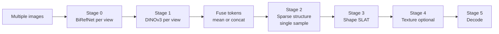
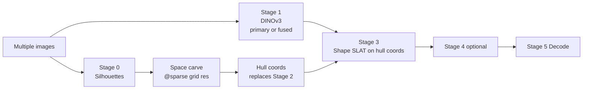
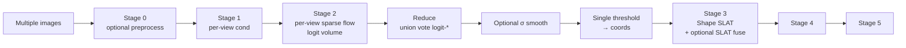

# TRELLIS.2 — Multiview Experiment Registry

This document records **four inference strategies** used to probe multi-image TRELLIS.2: single-image baseline, joint conditioning (P1), scaffold bypass (P2), and sparse occupancy fusion (plus optional SLAT fusion). For architectural motivation see [trellis-multi-image-conclusion.md](trellis-multi-image-conclusion.md), [pipeline-findings.md](pipeline-findings.md), and [stakeholder-brief.md](stakeholder-brief.md).

**How to read the tables:** Voxel counts (e.g. **1145** vs **2485**) come from **different input sets** — one image (`input/boat-1/back-right.png`) vs four views of the same vessel — so they are **not** comparable across those groups.

**Artifact layout:** Run folders under [`out/`](../out/) store `summary.json` plus per-condition subdirs. [`out/benchmark/`](../out/benchmark/) holds older **array-shaped** `benchmark_summary_*.json` files (not `{ "run", "conditions" }`). Sparse/SLAT fusion experiments often emitted **GLBs only** at [`out/*.glb`](../out/) with the config encoded in the filename.

---

## 1. Baseline — Single Image

**Why we tried this:** The stock pipeline is the timing and quality reference; every multi-image change is judged against it ([pipeline-findings.md](pipeline-findings.md) — high-level `run()` order).

**Implementation:** [`scripts/runs/baseline.py`](../scripts/runs/baseline.py) preprocesses the **first** positional image only, then [`run_baseline_core`](../scripts/runs/_common.py) runs Stage 1 conditioning → learned sparse structure → shape/texture SLAT → decode (or stops early with `--sparse-only`).

### Recorded runs (`summary.json` and benchmark arrays)

| Source | Condition | Pipeline | Views (listed) | Textures | Voxels | Elapsed s | Status |
|--------|-----------|----------|----------------|----------|--------|-----------|--------|
| [`out/run_20260507_084550/summary.json`](../out/run_20260507_084550/summary.json) | baseline | `1024_cascade` | 4 (first used) | yes | 2485 | 327.72 | ok |
| [`out/run_20260507_094039/summary.json`](../out/run_20260507_094039/summary.json) | baseline | `512` | 4 (first used) | no | 2485 | 186.86 | ok |
| [`out/run_20260511_090441_textured/summary.json`](../out/run_20260511_090441_textured/summary.json) | baseline | `1024_cascade` | 1 | yes | 1145 | 175.99 | ok |
| [`out/run_20260511_090949/summary.json`](../out/run_20260511_090949/summary.json) | baseline | `1024_cascade` | 1 | no | 1145 | 115.38 | ok |
| [`out/run_20260511_092717/summary.json`](../out/run_20260511_092717/summary.json) | baseline | `1024_cascade` | 1 | no | 1145 | 118.21 | ok |
| [`out/run_20260511_093621/summary.json`](../out/run_20260511_093621/summary.json) | baseline | `1024_cascade` | 1 | no | 1145 | 113.05 | ok |
| [`out/run_20260511_101815/summary.json`](../out/run_20260511_101815/summary.json) | baseline | `512` | 4 | no | 2485 | 101.08 | ok |
| [`out/benchmark/benchmark_summary_2026-05-06T142448.304.json`](../out/benchmark/benchmark_summary_2026-05-06T142448.304.json) | baseline | not in file | not in file | (see GLB) | 2452 | 126.89 | ok |
| [`out/benchmark/benchmark_summary_2026-05-06T145217.951.json`](../out/benchmark/benchmark_summary_2026-05-06T145217.951.json) | baseline | not in file | not in file | (see GLB) | 1161 | 96.64 | ok |
| [`out/benchmark/benchmark_summary_2026-05-06T151027.201.json`](../out/benchmark/benchmark_summary_2026-05-06T151027.201.json) | baseline | not in file | not in file | (see GLB) | 1161 | 206.24 | ok |
| [`out/run_20260511_101543/`](../out/run_20260511_101543/) | (none) | — | — | — | — | — | **partial** — `baseline/model.glb` only, no `summary.json` |

**Next steps:** None — keep as the control; re-run when inputs or hardware baseline change.

---

## 2. P1 — Joint Condition Fusion

**Why we tried this:** Fusing all views **before** Stage 2 is the most model-native place to combine evidence without independent sparse samples ([trellis-multi-image-conclusion.md](trellis-multi-image-conclusion.md); [pipeline-findings.md](pipeline-findings.md) — `get_cond_multi`).

**Implementation:** [`scripts/runs/p1_condition_fusion.py`](../scripts/runs/p1_condition_fusion.py) preprocesses every view, builds joint cond via `get_cond_multi(..., fusion_mode)` with `--mode mean|concat`, then [`run_p1_core`](../scripts/runs/_common.py) runs **one** sparse-structure sample and continues through SLAT/decode (`concat` lengthens the token sequence for cross-attention).

### Recorded runs

| Source | Condition | Mode | Pipeline | Views (listed) | Tex | Voxels | Elapsed s | Status |
|--------|-----------|------|----------|----------------|-----|--------|-----------|--------|
| `out/run_20260507_084550/summary.json` | P1-mean | mean | `1024_cascade` | 4 | yes | 1940 | 319.92 | ok |
| `out/run_20260507_084550/summary.json` | P1-concat | concat | `1024_cascade` | 4 | yes | 2601 | 303.10 | ok |
| `out/run_20260507_094039/summary.json` | P1-mean | mean | `512` | 4 | no | 1940 | 200.27 | ok |
| `out/run_20260507_094039/summary.json` | P1-concat | concat | `512` | 4 | no | 2601 | 211.91 | ok |
| `out/run_20260511_092717/summary.json` | P1-mean | mean | `1024_cascade` | 1* | no | 1145 | 106.84 | ok |
| `out/run_20260511_092717/summary.json` | P1-concat | concat | `1024_cascade` | 1* | no | 1145 | 104.57 | ok |
| `out/run_20260511_093621/summary.json` | P1-mean | mean | `1024_cascade` | 1* | no | 1145 | 102.39 | ok |
| `out/run_20260511_093621/summary.json` | P1-concat | concat | `1024_cascade` | 1* | no | 1145 | 98.23 | ok |
| `out/run_20260511_101815/summary.json` | P1-mean | mean | `512` | 4 | no | 1940 | 90.11 | ok |
| `out/run_20260511_101815/summary.json` | P1-concat | concat | `512` | 4 | no | 2601 | 93.09 | ok |
| `out/benchmark/benchmark_summary_2026-05-06T142448.304.json` | P1-mean | mean | — | — | — | 1513 | 76.09 | ok |
| `out/benchmark/benchmark_summary_2026-05-06T142448.304.json` | P1-concat | concat | — | — | — | 2014 | 118.09 | ok |
| `out/benchmark/benchmark_summary_2026-05-06T145217.951.json` | P1-mean | mean | — | — | — | 1456 | 68.19 | ok |
| `out/benchmark/benchmark_summary_2026-05-06T145217.951.json` | P1-concat | concat | — | — | — | 1400 | 84.72 | ok |
| `out/benchmark/benchmark_summary_2026-05-06T151027.201.json` | P1-mean | mean | — | — | — | 1456 | 202.11 | ok |
| `out/benchmark/benchmark_summary_2026-05-06T151027.201.json` | P1-concat | concat | — | — | — | 1401 | 304.52 | ok |
| `out/run_20260507_091726/` | — | — | — | — | — | — | — | **partial** — empty `P1-mean/`, no `summary.json` |

\*Summaries list **one** image path for these matrix rows; today’s [`p1_condition_fusion.py`](../scripts/runs/p1_condition_fusion.py) requires **≥2** images — treat these rows as legacy/dispatcher-specific when reproducing.

**Next steps**

- Add **pose-aware** per-view embeddings (azimuth, elevation, FoV) before fusion — current cond has no camera model ([trellis-multi-image-conclusion.md](trellis-multi-image-conclusion.md), [stakeholder-brief.md](stakeholder-brief.md) §8.2).
- Run **`concat` with ≥3 views on `512` pipeline** first; `1024_cascade` + `concat` OOMs on 24 GB GPUs ([stakeholder-brief.md](stakeholder-brief.md) §6.3).

---

## 3. P2 — Scaffold Bypass

**Why we tried this:** Stage 2 samples a **full canonical object per view**; replacing it with an externally consistent hull is the recommended near-term engineering path for calibrated capture ([trellis-multi-image-conclusion.md](trellis-multi-image-conclusion.md); [stakeholder-brief.md](stakeholder-brief.md) §8.2 Priority 1).

**Implementation:** [`scripts/runs/p2_scaffold.py`](../scripts/runs/p2_scaffold.py) builds silhouettes (BiRefNet), **space-carves** a hull at [`sparse_grid_resolution(pipeline)`](../scripts/runs/_common.py), converts to `coords`, skips learned sparse sampling, then runs stages 3–5 with `--cond-fusion primary|mean|concat` for image conditioning (`P2-scaffold+P1` in benchmarks = fused cond + hull; naming in `summary.json` matches [`scripts/benchmark_multiview.py`](../scripts/benchmark_multiview.py) labels).

### Recorded runs

| Source | Condition | Cond fusion | Pipeline | Views (listed) | Voxels | Elapsed s | Status |
|--------|-----------|-------------|----------|----------------|--------|-----------|--------|
| `out/run_20260511_092717/summary.json` | P2-scaffold | primary | `1024_cascade` | 1 | 0 | 92.82 | **CUDA OOM** |
| `out/run_20260511_092717/summary.json` | P2-scaffold+P1 | mean (fused cond) | `1024_cascade` | 1 | 0 | 94.85 | **CUDA OOM** |
| `out/run_20260511_093621/summary.json` | P2-scaffold | primary | `1024_cascade` | 1 | 0 | 93.06 | **CUDA OOM** |
| `out/run_20260511_093621/summary.json` | P2-scaffold+P1 | mean | `1024_cascade` | 1 | 0 | 93.64 | **CUDA OOM** |
| `out/benchmark/benchmark_summary_2026-05-06T142448.304.json` | P2-scaffold | — | — | — | 0 | 118.59 | **CUDA OOM** |
| `out/benchmark/benchmark_summary_2026-05-06T142448.304.json` | P2-scaffold+P1 | — | — | — | 0 | 102.91 | **CUDA OOM** |
| `out/benchmark/benchmark_summary_2026-05-06T145217.951.json` | P2-scaffold | — | — | — | 0 | 101.77 | **CUDA OOM** |
| `out/benchmark/benchmark_summary_2026-05-06T145217.951.json` | P2-scaffold+P1 | — | — | — | 0 | 103.38 | **CUDA OOM** |
| `out/benchmark/benchmark_summary_2026-05-06T151027.201.json` | P2-scaffold | — | — | — | 0 | 221.00 | **CUDA OOM** |
| `out/benchmark/benchmark_summary_2026-05-06T151027.201.json` | P2-scaffold+P1 | — | — | — | 0 | 222.62 | **CUDA OOM** |

Empty output dirs `P2-scaffold/` / `P2-scaffold_plus_P1/` under `run_20260511_092717` and `run_20260511_093621` match these failures.

**Scaffold stats (pre-OOM geometry):** For `run_20260511_092717` / `093621`, `run.scaffold` reports e.g. `grid_size` 32, **8022** occupied voxels (~24.5% of 32³) before Stage 3 — useful when comparing hull density to learned sparse output.

**Next steps**

- First **successful** P2 run: `--pipeline 512` (and real **≥2** views per [`p2_scaffold.py`](../scripts/runs/p2_scaffold.py)); none recorded yet under `out/run_*`.
- Try **`--cond-fusion mean`** at 512 after primary works.
- Larger GPU or memory tricks if `1024_cascade` + hull coords is required ([stakeholder-brief.md](stakeholder-brief.md) §6.3).

---

## 4. Sparse Occupancy Fusion (+ optional SLAT fusion)

**Why we tried this:** Independent sparse samples rarely agree voxel-to-voxel; fusing **logits** before one threshold recovers joint sub-threshold evidence ([pipeline-findings.md](pipeline-findings.md) — logit fusion row).

**Implementation:** [`scripts/runs/sparse_fusion.py`](../scripts/runs/sparse_fusion.py) calls `pipeline.run_multi_image(..., sparse_fusion_mode=--fusion, slat_fusion_mode="primary", ...)` — per-view sparse flow → stack logit volumes → `mean|max|sum|union|vote` → optional Gaussian smooth → threshold → **one** shape SLAT path. [`scripts/runs/slat_fusion.py`](../scripts/runs/slat_fusion.py) is the same entry with `--sparse-mode` + **`--mode slat-*`** to fuse SLAT features across views.

### 4a. Sparse-only fusion (GLB artifacts, no `summary.json`)

Configs are **filename conventions**; default script flags unless you changed CLI: `vote` uses 0.5 except where filename suggests otherwise (`vote-33` → 0.33). **`multi_*`** = early naming; later runs drop the prefix.

| File (`out/`) | Fusion | σ smooth | Filter K | samples/view | Notes |
|-----------------|--------|----------|----------|--------------|--------|
| [`multi_union_2026-05-06T095403.702.glb`](../out/multi_union_2026-05-06T095403.702.glb) | union | 0 | 0 | 1 | first union |
| [`multi_union_fn2_2026-05-06T102056.001.glb`](../out/multi_union_fn2_2026-05-06T102056.001.glb) | union | 0 | 2 | 1 | `--filter-min-neighbors 2` |
| [`multi_union_fn8_2026-05-06T102640.445.glb`](../out/multi_union_fn8_2026-05-06T102640.445.glb) | union | 0 | 8 | 1 | strong island prune |
| [`multi_vote_2026-05-06T100224.739.glb`](../out/multi_vote_2026-05-06T100224.739.glb) | vote | 0 | 0 | 1 | default threshold 0.5 |
| [`multi_logit_mean_2026-05-06T104922.304.glb`](../out/multi_logit_mean_2026-05-06T104922.304.glb) | logit-mean | 0 | 0 | 1 | |
| [`multi_logit_max_2026-05-06T105355.208.glb`](../out/multi_logit_max_2026-05-06T105355.208.glb) | logit-max | 0 | 0 | 1 | |
| [`multi_logit_mean_sm0.8_2026-05-06T105809.532.glb`](../out/multi_logit_mean_sm0.8_2026-05-06T105809.532.glb) | logit-mean | 0.8 | 0 | 1 | |
| [`multi_logit_mean_spv3_2026-05-06T110156.349.glb`](../out/multi_logit_mean_spv3_2026-05-06T110156.349.glb) | logit-mean | 0 | 0 | 3 | `--samples-per-view 3` |
| [`union_2026-05-06T113237.047.glb`](../out/union_2026-05-06T113237.047.glb) | union | 0 | 0 | 1 | second batch |
| [`union+fn2_2026-05-06T113425.522.glb`](../out/union+fn2_2026-05-06T113425.522.glb) | union | 0 | 2 | 1 | |
| [`vote-33_2026-05-06T113614.340.glb`](../out/vote-33_2026-05-06T113614.340.glb) | vote | 0 | 0 | 1 | implies `--vote-threshold 0.33` |
| [`logit-mean_2026-05-06T113638.418.glb`](../out/logit-mean_2026-05-06T113638.418.glb) | logit-mean | 0 | 0 | 1 | |
| [`logit-max_2026-05-06T113827.616.glb`](../out/logit-max_2026-05-06T113827.616.glb) | logit-max | 0 | 0 | 1 | |
| [`logit-mean+sm0.5_2026-05-06T114030.091.glb`](../out/logit-mean+sm0.5_2026-05-06T114030.091.glb) | logit-mean | 0.5 | 0 | 1 | |
| [`logit-mean+sm0.8_2026-05-06T114049.038.glb`](../out/logit-mean+sm0.8_2026-05-06T114049.038.glb) | logit-mean | 0.8 | 0 | 1 | strong qualitative reference |
| [`logit-mean+fn2_2026-05-06T114111.911.glb`](../out/logit-mean+fn2_2026-05-06T114111.911.glb) | logit-mean | 0 | 2 | 1 | |

### 4b. SLAT fusion on top of logit-mean sparse (`slat_fusion.py`)

| File (`out/`) | Sparse mode | σ | SLAT `--mode` |
|---------------|-------------|---|---------------|
| [`lm+slat-mean_2026-05-06T114148.103.glb`](../out/lm+slat-mean_2026-05-06T114148.103.glb) | logit-mean | 0 | slat-mean |
| [`lm+slat-nw_2026-05-06T114217.427.glb`](../out/lm+slat-nw_2026-05-06T114217.427.glb) | logit-mean | 0 | slat-norm-weighted |
| [`lm+slat-max_2026-05-06T114244.915.glb`](../out/lm+slat-max_2026-05-06T114244.915.glb) | logit-mean | 0 | slat-max |
| [`lm+sm0.8+slat-mean_2026-05-06T114309.490.glb`](../out/lm+sm0.8+slat-mean_2026-05-06T114309.490.glb) | logit-mean | 0.8 | slat-mean |

**Next steps**

- Run **`logit-mean` + `sm0.8` + `fn2`** together (not yet in `out/*.glb` list).
- Re-run best sparse configs with **`--pipeline 512`** for fast multiview sweeps on 24 GB hardware.
- A/B: `lm+sm0.8+slat-mean` vs `logit-mean+sm0.8` to see if SLAT fusion adds value once logits are smoothed ([trellis-multi-image-conclusion.md](trellis-multi-image-conclusion.md) — late fusion limits).
- Prefer writing **`summary.json`** for new sparse runs (extend [`sparse_fusion.py`](../scripts/runs/sparse_fusion.py) artifact naming or post-hook) so voxel counts and timings are registered like P1/P2.

---

## Appendix — Partial / inconsistent artifacts

| Path | Issue |
|------|--------|
| `out/run_20260507_091726/` | `P1-mean/` empty; no `summary.json` |
| `out/run_20260511_101543/` | `baseline/model.glb` only |
| `out/run_20260511_090441_textured/summary.json` | `model_path` references `run_20260511_090441` while folder is `*_textured` |

---

## Appendix — Benchmark JSON schema

Files `out/benchmark/benchmark_summary_*.json` are **JSON arrays** of objects with `name`, `voxels`, `elapsed_s`, `glb_path`, `error` — not the multi-condition wrapper used under `out/run_*`.
