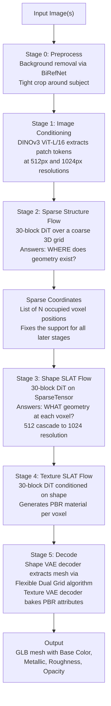

# TRELLIS.2 — 3D Generation Pipeline: Stakeholder Brief

**Document version:** May 2026  
**Authors:** Engineering team  
**Audience:** Board of stakeholders  
**Source references:** [pipeline-findings.md](pipeline-findings.md) · [research-topics.md](research-topics.md) · [trellis-multi-image-conclusion.md](trellis-multi-image-conclusion.md) · [TRELLIS.2 paper (arxiv:2512.14692)](https://arxiv.org/abs/2512.14692)

---

## 1. Executive Summary

TRELLIS.2 is a 4-billion-parameter open-source 3D generative model released by Microsoft in December 2025. It accepts a single photograph as input and produces a fully textured, physically-based rendering (PBR) 3D asset at resolutions up to 1536³ voxels in under 60 seconds on a single NVIDIA H100 GPU.

Our team has adopted TRELLIS.2 as the foundation for a marine vessel 3D reconstruction pipeline. The core challenge we are addressing is that the model was originally designed for single-image generation, whereas real-world vessel capture involves multiple calibrated camera views. This brief documents:

- What the TRELLIS.2 pipeline is and how it works
- Which models and components it uses
- What changes we have made to support multi-image input
- The full dependency stack
- Training compute and dataset requirements for any future fine-tuning or domain adaptation

**Current status:** All inference-time multi-image fusion strategies have been implemented and tested. Binary, logit-level, depth-guided, and symmetry-constrained fusion are all available. Experimental evaluation has surfaced an architectural bottleneck (described in Section 7) that informs our recommended next research phase.

---

## 2. Pipeline Architecture

TRELLIS.2 is not a mesh generator in the conventional sense. Its internal representation is a *structured sparse latent* (SLAT) — a set of learned feature vectors anchored to occupied positions in a 3D voxel grid. A mesh is only one possible decoded output; the latent itself is geometry- and appearance-agnostic. This distinction is critical for understanding where improvements have the highest leverage.

The pipeline runs in six sequential stages:

### Key representation concepts

**O-Voxel (Omni-Voxel):** TRELLIS.2's core 3D representation, developed by Microsoft. Unlike occupancy fields or signed-distance functions, O-Voxel stores geometry directly as sparse voxels, each holding a dual vertex position and edge intersection flags derived via a Quadratic Error Function (QEF). This enables representation of open surfaces, non-manifold geometry, and enclosed interior structures — all categories that collapse in field-based methods. Conversion between a raw mesh and O-Voxel is CPU-only and takes under 10 seconds; the reverse reconstruction completes in under 100 ms on GPU.

**SparseTensor:** The in-memory data structure used throughout the pipeline. It pairs integer voxel coordinates `(N × 4: batch, x, y, z)` with floating-point feature vectors `(N × C)`. Only occupied voxels are stored and computed on. For a typical asset at 1024³ resolution, N is approximately 9,600 tokens — far fewer than a dense 1024³ grid of over 1 billion voxels.

**Flow Matching:** The generative algorithm used at every diffusion stage. Unlike the more common DDPM (Denoising Diffusion Probabilistic Models), flow matching learns a straight-line velocity field from noise to clean data. This makes sampling faster and more stable. Classifier-free guidance (CFG) is used at inference to sharpen results; CFG dropout rate during training is 10%.

**512 → 1024 cascade:** Shape generation first runs at 512³ resolution to establish coarse structure, then the decoder predicts subdivision coordinates, and a second higher-resolution flow pass refines fine details on the denser coordinate set. This progressive strategy transfers learned priors efficiently and enables resolutions beyond the training scale.

---

## 3. Models Used

TRELLIS.2 loads eight distinct models at inference time. The pipeline is modular: each stage can be improved or replaced independently.

### 3.1 Image conditioning model

| Property | Value |
|----------|-------|
| Model | DINOv3 ViT-L/16 |
| Source | `facebook/dinov3-vitl16-pretrain-lvd1689m` (Meta AI, HuggingFace) |
| Parameters | 300M |
| Architecture | Vision Transformer, patch size 16, embedding dim 1024, 16 heads, RoPE positional embeddings |
| Pretraining data | LVD-1689M (1.69 billion curated web images) |
| Upgrade from original TRELLIS | DINOv2 → DINOv3; absolute positional embeddings → RoPE |
| Role in pipeline | Extracts a sequence of patch tokens `(B, N_patches, 1024)` at 512px and 1024px. Every downstream flow model cross-attends to these tokens at each transformer layer. |
| License | DINOv3 License (Meta AI — requires acceptance) |

### 3.2 Background removal model

| Property | Value |
|----------|-------|
| Model | BiRefNet |
| Role | Removes background, produces alpha-masked crop before any 3D reasoning |
| Effect on quality | Mis-segmentation propagates fully into all downstream stages; critical for thin vessel structures (masts, radar) |

### 3.3 Generative flow models (three DiTs)

All three DiT modules share the same architecture, scaled to approximately 1.3 billion parameters each:

| Hyperparameter | Value |
|----------------|-------|
| Transformer blocks | 30 |
| Hidden width | 1,536 channels |
| Attention heads | 12 |
| MLP width | 8,192 |
| Positional encoding | RoPE |
| Modulation | AdaLN-single |
| Attention normalisation | QK-RMSNorm |
| Precision | bfloat16 |

| Instance | Stage | Input / output |
|----------|-------|---------------|
| `SparseStructureFlowModel` | Stage 2 — sparse structure | Dense `(B, 8, 16, 16, 16)` noise → occupancy logits → binary voxel coords |
| `ElasticSLatFlowModel` × 2 | Stage 3 — shape SLAT | `SparseTensor` noise on fixed coords → shape feature vectors (32ch) at 512 and 1024 resolution |
| `SLatFlowModel` × 2 | Stage 4 — texture SLAT | `SparseTensor` noise + concatenated shape features → PBR material features (32ch) at 512 and 1024 resolution |

### 3.4 Sparse Compression VAEs (SC-VAEs)

Two SC-VAEs are trained separately for shape and texture. Both use `FlexiDualGridVaeEncoder / Decoder` architecture (ConvNeXt-style sparse residual blocks, 5 resolution levels):

| Property | Shape VAE | Texture VAE |
|----------|-----------|-------------|
| Input representation | O-Voxel geometry (dual vertices, intersection flags) | O-Voxel PBR attributes (base color, metallic, roughness, opacity) |
| Latent channels | 32 | 32 |
| Spatial downsampling | 16× | 16× |
| Training resolution | 256³ → fine-tuned to 512³ | 256³ → fine-tuned to 512³ |
| Tokens at 1024³ | ~9,600 | ~9,600 |

The decoder predicts per-voxel subdivision masks (`subs`) at each upsampling step; the texture decoder receives these same masks (`guide_subs`) to ensure exact spatial alignment between shape and material voxels.

### 3.5 PBR material layout

Each texture voxel stores 6 channels: `base_color` (RGB: channels 0–2), `metallic` (channel 3), `roughness` (channel 4), `alpha` / opacity (channel 5).

---

## 4. Our Changes to the Pipeline

All modifications are inference-time additions — no model weights were retrained. The changes hook into the existing pipeline at well-defined seams identified during our code investigation documented in [pipeline-findings.md](pipeline-findings.md).

### 4.1 Multi-image binary sparse occupancy fusion

The sparse structure flow model is run once per input image. The resulting per-view binary occupancy volumes are then fused before extracting the coordinate set that governs all later stages.

| Mode | Behaviour | Status |
|------|-----------|--------|
| `union` | Any view votes occupied → occupied. Maximises coverage. | Complete |
| `vote` (threshold ≥ 0.5) | Majority of views must agree. Maximises coherence. | Complete |

**Key finding:** Union produces ~18K voxels with good coverage but accumulates per-view hallucinations. Vote collapses to ~1K voxels because independent runs rarely agree on the same voxels even for real geometry, since the model generates a complete canonical object per view rather than a partial view-consistent observation.

### 4.2 Intra-view ensemble

For each input view, the flow model is run N times independently (flag: `--samples-per-view N`). Raw occupancy logits are averaged before thresholding. This reduces stochastic noise within a single view without requiring camera awareness.

### 4.3 Neighbourhood filter

A 3D convolution counts the number of occupied neighbours per voxel (flag: `--filter-min-neighbors K`). Voxels with fewer than K neighbours are discarded. This removes the isolated floating islands produced by union fusion while preserving contiguous surfaces.

### 4.4 Logit-level probabilistic fusion

Instead of thresholding each view's occupancy decoder independently and then merging binary sets, raw float activations are retained across all views and a single threshold is applied after cross-view reduction. This recovers voxels where one view scores 0.49 and another scores 0.48 — individually below threshold but jointly strong evidence.

| Mode | Behaviour |
|------|-----------|
| `logit-mean` | Average scores across views; expected best general-purpose mode |
| `logit-max` | Strongest per-voxel signal wins; useful when one view dominates |
| `logit-sum` | Additive evidence; threshold scales with number of views |

An optional 3D Gaussian smoothing pass (`--logit-smooth-sigma`) applies spatial confidence diffusion using an analytic kernel (no learned weights) before the final threshold, reinforcing weak-evidence voxels adjacent to stronger neighbours.

### 4.5 Depth-guided occupancy bias(testing in progress)

A monocular depth model (compatible with Depth Anything V2, MoGe, or UniDepth) back-projects a depth map into 3D space, producing a `(1, C, G, G, G)` float bias volume. This volume is added to the initial Gaussian noise before the flow model runs, steering sampling toward known-occupied regions. Recommended bias scale: 0.5–2.0. For multi-view input, bias volumes from each view are averaged.

### 4.6 Symmetry prior

`Trellis2ImageTo3DPipeline.apply_symmetry_prior(coords, grid_size, axis)` mirrors all occupied voxels across the midplane of the specified axis and deduplicates. For marine vessels with port/starboard symmetry, `axis=0` (the beam axis) enforces hull consistency regardless of which side is visible to the camera.

### 4.7 Multi-image early feature fusion

`get_cond_multi(images, resolution, fusion_mode)` encodes each image independently through DINOv3 and fuses the resulting patch token sequences:

- `mean`: token-wise average → same `(1, N_patches, 1024)` shape as single-image conditioning; drop-in replacement
- `concat`: token sequences stacked → `(1, V × N_patches, 1024)`; the cross-attention in `SLatFlowModel` handles longer sequences natively

`run_multi_image_cond()` runs a single pass of stages 2–4 from the joint condition. The texture stage always uses the primary (first) image only, since texture is view-dependent.

### 4.8 Scaffold bypass(implemented, not tested)

`scripts/scaffold_bypass.py` accepts an externally computed sparse occupancy (from TSDF fusion, silhouette carving, or any photogrammetry tool) and feeds it directly as the `coords` input to the shape SLAT stage, completely bypassing stage 2. This is the architecturally cleanest path for calibrated multi-camera vessel inputs and is our recommended near-term engineering direction.

---

## 5. Dependencies

### 5.1 Runtime / inference

| Package | Version | Role |
|---------|---------|------|
| Python | 3.10 | Runtime |
| PyTorch | 2.6.0 | Core tensor / autograd framework |
| CUDA Toolkit | 12.4 | Required for all custom CUDA extensions |
| torchvision | 0.21.0 | Image transforms |
| transformers | 4.57.0 | HuggingFace model loading (DINOv3, BiRefNet) |
| flash-attn | 2.7.3 | Fused attention kernel; default attention backend. For GPUs without flash-attn support (e.g. V100), `xformers` can be substituted via env var `ATTN_BACKEND=xformers` |
| nvdiffrast | v0.4.0 | NVIDIA differentiable rasterizer; used for mesh rendering and visualisation |
| nvdiffrec | (renderutils branch) | Split-sum renderer for PBR material evaluation |
| o-voxel | built from source | Core O-Voxel conversion, mesh extraction, GLB export (custom Microsoft library, ships in this repo) |
| FlexGEMM | latest | Triton-based sparse convolution backend for the sparse transformer blocks |
| CuMesh | latest | CUDA mesh utilities: remeshing, decimation, UV-unwrapping for GLB export |
| trimesh | latest | CPU mesh I/O |
| imageio / imageio-ffmpeg | latest | Video export |
| opencv-python-headless | latest | Image processing |
| kornia | latest | Geometric image transforms |
| timm | latest | Vision model utilities |
| gradio | 6.0.1 | Web demo UI |
| utils3d | pinned commit | 3D geometry utilities (from GitHub) |

### 5.2 Training (additional)

| Package | Role |
|---------|------|
| lpips | Perceptual loss for VAE fine-tuning |
| tensorboard | Training visualisation |
| pandas | Dataset metadata handling |
| zstandard | Compressed dataset I/O |
| psutil | Memory monitoring during training |

### 5.3 Data preparation (additional)

| Tool | Role |
|------|------|
| Blender | Renders 16 conditioning views per asset with randomised FoV and lighting |
| data_toolkit Python scripts | Download, mesh dump, PBR dump, voxelization, latent encoding (see `data_toolkit/README.md`) |

### 5.4 Installation notes

All dependencies are installed through `./setup.sh` with component flags (`--basic`, `--flash-attn`, `--o-voxel`, `--flexgemm`, `--cumesh`, `--nvdiffrast`, `--nvdiffrec`). The `o-voxel`, `FlexGEMM`, and `CuMesh` packages require compilation against the active CUDA Toolkit; `CUDA_HOME` must point to CUDA 12.4 and `TORCH_CUDA_ARCH_LIST` must target the deployment GPU architecture. On memory-constrained build environments, `MAX_JOBS=1` prevents OOM during parallel `nvcc` compilation.

---

## 6. Training Requirements

All GPU counts and batch sizes are sourced directly from the TRELLIS.2 paper supplementary (arxiv:2512.14692). Duration estimates are derived from the original TRELLIS training disclosures (64 × A100, 7–10 days per DiT) scaled for H100 throughput (H100 ≈ 2× A100 for bfloat16 training).

### 6.1 Full training from scratch

| Stage | Config file | GPUs | Global batch | Precision | Steps | Est. wall time |
|-------|-------------|------|-------------|-----------|-------|---------------|
| SC-VAE stage 1 (shape + texture, 256³) | `shape_vae_next_dc_f16c32_fp16.json` / `tex_vae_...json` | 16 × H100 80GB | 128 | fp16 | 1M | ~3–4 days |
| SC-VAE stage 2 fine-tune (512³) | `*_ft_512.json` | 16 × H100 80GB | 128 | fp16 | additional | ~1–2 days |
| Sparse Structure Flow DiT (~1.3B) | `ss_flow_img_dit_1_3B_64_bf16.json` | 32 × H100 80GB | 256 | bfloat16 | 1M | ~7 days |
| Shape SLAT Flow DiT (~1.3B) | `slat_flow_img2shape_dit_1_3B_512_bf16.json` | 32 × H100 80GB | 256 | bfloat16 | 1M | ~7 days |
| Texture SLAT Flow DiT (~1.3B) | `slat_flow_imgshape2tex_dit_1_3B_512_bf16.json` | 32 × H100 80GB | 256 | bfloat16 | 1M | ~7 days |
| High-res fine-tunes (1024³) | `*_ft1024.json` | 32 × H100 80GB | 256 | bfloat16 | additional | ~3–5 days each |

**Total full-training estimate:** ~30–40 GPU-days (wall time on a 32-node H100 cluster, running stages sequentially). This equates to approximately **960–1,280 H100 GPU-hours** for the generative model stages alone, not counting the VAE.

### 6.2 Optimizer and regularisation (all stages)

| Parameter | Value |
|-----------|-------|
| Optimizer | AdamW |
| Learning rate | 1 × 10⁻⁴ |
| Weight decay | 0.01 (flow models); 0.0 (VAE) |
| β₁ / β₂ | 0.9 / 0.95 |
| Gradient clip | Adaptive, 95th-percentile, max norm 1.0 |
| EMA decay | 0.9999 |
| CFG drop rate | 10% |
| Timestep schedule | logit-Normal (sparse structure); uniform (SLAT) |

### 6.3 Domain fine-tuning (our recommended path)

For adapting TRELLIS.2 to marine vessel data without full retraining, the Sparse Structure stage is the highest-value target (see Section 7). Freezing the shape and texture SLAT models and the VAEs reduces the training footprint substantially:

| Scenario | Estimated GPUs | Est. duration |
|----------|---------------|--------------|
| Inference only | 1 × 24GB VRAM GPU | — |
| Fine-tune sparse structure DiT only (frozen everything else) | 4–8 × H100 80GB | 3–5 days |
| Train multiview-aware sparse structure model from scratch | 8–16 × H100 80GB | 5–10 days |
| Full 4B replication from scratch | 32–64 × H100 80GB | ~30–40 days sequential |

### 6.4 Inference hardware

| Metric | Value |
|--------|-------|
| Minimum VRAM | 24 GB (RTX 3090 / A6000 / A100-40GB) |
| Verified hardware | NVIDIA A100 (40 GB / 80 GB), H100 (80 GB) |
| 512³ generation time (H100) | ~3 seconds |
| 1024³ generation time (H100) | ~17 seconds |
| 1536³ generation time (H100) | ~60 seconds |
| Benchmark measurements in paper | Reported on NVIDIA A100 |

---

## 7. Dataset Requirements

### 7.1 Training datasets

| Dataset | Used for | Scale | License |
|---------|----------|-------|---------|
| Objaverse-XL (Sketchfab source) | Generative model (DiTs) | ~800K objects | ODC-By v1.0 per dataset; individual object licenses vary |
| TexVerse | Generative model (PBR augmentation) | — | — |
| Objaverse-XL + ABO + HSSD | SC-VAE ("Trellis-500K" filtered for PBR) | ~500K PBR assets | Mixed |
| ABO (Amazon Berkeley Objects) | SC-VAE | ~8K objects | CC-BY-4.0 |
| HSSD (Habitat Synthetic Scenes) | SC-VAE | ~211 scenes | CC-BY-4.0 |

All training assets are filtered to an aesthetic quality score of ≥ 4.5 before use.

### 7.2 Evaluation datasets

| Dataset | Purpose |
|---------|---------|
| Toys4K | Shape reconstruction benchmark |
| Sketchfab Featured (90 curated assets) | Generation quality evaluation; selected from Sketchfab posts within two years of paper submission to ensure training-test disjointness |
| SketchfabPicked | Internal generation quality test set |

### 7.3 Scale and storage estimates

| Item | Estimate |
|------|----------|
| Objaverse 1.0 (800K objects, base of Sketchfab source) | ~10 TB raw meshes + textures |
| Full Objaverse-XL (10.2M objects) | ~100 TB |
| Preprocessed training data (O-Voxel at 256/512/1024³ + encoded latents + 16 renders/asset) | **~20–50 TB** for the 800K Sketchfab subset |

### 7.4 Data preprocessing pipeline

Documented in full in [`data_toolkit/README.md`](../data_toolkit/README.md). The pipeline supports distributed execution via `--rank / --world_size` flags at every step:

1. **Download** — raw 3D assets from Objaverse-XL, ABO, HSSD
2. **Mesh dump** — standardise geometry to a common format (CPU-only; parallelisable)
3. **PBR dump** — extract and standardise PBR texture maps (CPU-only)
4. **Asset statistics** — compute per-asset metadata (aesthetic score, face count, etc.)
5. **O-Voxel conversion** — voxelize mesh and PBR at 256³, 512³, 1024³ (CPU-only; ~10s per asset)
6. **Latent encoding** — run trained SC-VAE encoder to produce cached shape and PBR latents
7. **Conditioning renders** — Blender renders 16 views per asset with randomised FoV and lighting conditions

At step 6, the dataset is ready for SC-VAE training. The generative model (DiT) training additionally requires step 7.

---

## 8. Research Findings and Recommendations

### 8.1 Why the current fusion strategies are limited

The core finding, detailed in [trellis-multi-image-conclusion.md](trellis-multi-image-conclusion.md) and grounded in the pipeline code, is that TRELLIS.2 is architecturally a **single-image generative completion model**, not a camera-consistent multi-view reconstruction model.

The image conditioning extractor (`DinoV3FeatureExtractor`) passes semantic patch tokens into the flow models via cross-attention, but there is no camera model, no epipolar constraint, and no multiview reconstruction loss anywhere in the pipeline. When the sparse structure model receives a new image, it samples a plausible *complete canonical object* from a learned prior — not a *partial observation from that camera pose*.

This has direct consequences for all fusion strategies tested:

| Strategy | Outcome | Root cause |
|----------|---------|-----------|
| Binary union | Good coverage (~18K voxels) but duplicate competing hypotheses (two hull halves, multiple boats) | Each view generates a full independent object; union keeps all hypotheses |
| Binary vote (≥ 0.5) | Severe collapse (~1K voxels) | Stochastic support sampling → near-zero overlap between independent runs even for the same image |
| Logit mean | Recovers sub-threshold evidence; expected improvement over union | Still downstream of stochastic mode selection |
| SLAT fusion | Minimal change | Stage 3 cannot create geometry where Stage 2 left no coordinates; coordinates are fixed before SLAT diffusion begins |

The same-image ensemble experiment is particularly diagnostic: independent runs from the *same* photograph with different random seeds produce sparse structures with very low voxel overlap. This confirms the sparse structure stage is behaving as a stochastic sampler over a learned prior, not as a deterministic reconstruction module.

### 8.2 Ranked research directions

The following priorities reflect the team's analysis from [trellis-multi-image-conclusion.md](trellis-multi-image-conclusion.md):

**Priority 1 — Scaffold bypass (recommended near-term)**  
For calibrated multi-camera vessel capture, replace Stage 2 entirely with an externally computed sparse occupancy. Silhouette carving, TSDF fusion, or sparse photogrammetry can produce a much more stable hull scaffold than the single-image stochastic prior. This uses TRELLIS.2 where it is strongest — latent-space geometric refinement, surface detail, and material synthesis — while bypassing the stage causing the main failure. The seam is already exposed via `scripts/scaffold_bypass.py`.

**Priority 2 — Joint multi-image conditioning before Stage 2**  
Feed all views into a single pose-aware condition representation before running one sparse structure sample. Per-view image tokens should be augmented with learned view embeddings encoding camera azimuth, elevation, FoV, and optionally intrinsics. This is the model-native extension and the architecturally correct place to fuse multiple views. `get_cond_multi()` with `concat` mode is the current baseline; pose embedding is the missing component.

**Priority 3 — Fine-tune a multiview-aware Sparse Structure DiT**  
Train a new sparse structure model that takes multi-image condition tokens and produces a single coherent support layout, while keeping the pretrained shape SLAT, texture SLAT, and VAE models frozen. This targets the architectural bottleneck directly without requiring full retraining of the 4B system. Estimated compute: 4–8 × H100, 3–5 days, on paired multi-view vessel images with ground-truth sparse occupancy as supervision.

**Priority 4 (exploratory) — SLAT fusion with decoded geometry correspondence**  
Instead of fusing binary occupancy, decode multiple shape SLAT hypotheses to O-Voxel dual-vertex positions and establish correspondences in that richer geometric space before merging. More informative than raw voxel overlap, but still downstream of the mode-selection bottleneck.

### 8.3 Why vessel reconstruction is a good fit for TRELLIS.2

Despite the single-image limitation, TRELLIS.2 has properties that make it particularly well-suited to marine vessel geometry once the coarse scaffold is correctly provided:

| Vessel feature | Relevant TRELLIS.2 mechanism |
|----------------|------------------------------|
| Thin masts, antennas, radar domes | O-Voxel preserves thin structures via QEF vertex positioning; previous field-based methods collapse these |
| Non-manifold superstructure | O-Voxel explicitly supports non-manifold and open surfaces |
| Port/starboard symmetry | `apply_symmetry_prior()` enforces structural consistency before SLAT generation |
| Repeated railings, stanchions | Sparse transformer learns repetitive local patterns |
| PBR hull materials (paint, rust, weathering) | Native 3D PBR material generation is decoupled from geometry and propagates shape improvements automatically |

---

## 9. Dependency Licence Summary

| Component | Licence |
|-----------|---------|
| TRELLIS.2 code and pretrained weights | MIT |
| O-Voxel | MIT (within this repo) |
| DINOv3 ViT-L/16 | DINOv3 Licence (Meta AI — requires acceptance before use) |
| Objaverse-XL dataset | ODC-By v1.0 (dataset-level); individual object licences vary |
| nvdiffrast | Custom NVidia licence |
| nvdiffrec | Custom NVidia licence |
| FlexGEMM | Open source (JeffreyXiang/FlexGEMM) |
| CuMesh | Open source (JeffreyXiang/CuMesh) |
| flash-attn | BSD-3-Clause |
| PyTorch | BSD-style |

---

## 10. References

| Reference | URL |
|-----------|-----|
| TRELLIS.2 paper (Xiang et al., 2025) | https://arxiv.org/abs/2512.14692 |
| TRELLIS.2 GitHub | https://github.com/microsoft/TRELLIS.2 |
| TRELLIS.2-4B model card | https://huggingface.co/microsoft/TRELLIS.2-4B |
| DINOv3 paper (Siméoni et al., 2025) | https://arxiv.org/abs/2508.10104 |
| DINOv3 ViT-L/16 model card | https://huggingface.co/facebook/dinov3-vitl16-pretrain-lvd1689m |
| Objaverse-XL dataset (Deitke et al., 2023) | https://arxiv.org/abs/2307.05663 |
| Objaverse-XL on HuggingFace | https://huggingface.co/datasets/allenai/objaverse-xl |
| FlexGEMM (sparse convolution backend) | https://github.com/JeffreyXiang/FlexGEMM |
| CuMesh (CUDA mesh utilities) | https://github.com/JeffreyXiang/CuMesh |
| nvdiffrast (differentiable rasteriser) | https://github.com/NVlabs/nvdiffrast |
| flash-attention v2.7.3 | https://github.com/Dao-AILab/flash-attention |
| Internal pipeline deep-dive | [pipeline-findings.md](pipeline-findings.md) |
| Internal SLAT conceptual notes | [research-topics.md](research-topics.md) |
| Internal multi-image failure analysis | [trellis-multi-image-conclusion.md](trellis-multi-image-conclusion.md) |
